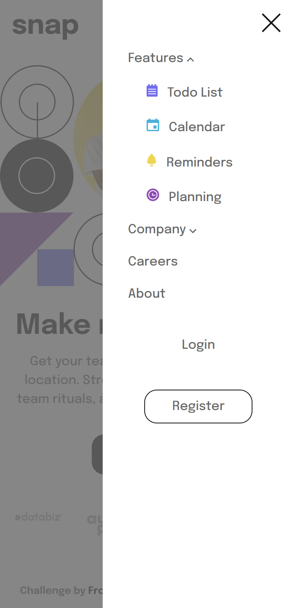

# Frontend Mentor - Intro section with dropdown navigation solution

This is a solution to the [Intro section with dropdown navigation challenge on Frontend Mentor](https://www.frontendmentor.io/challenges/intro-section-with-dropdown-navigation-ryaPetHE5). Frontend Mentor challenges help you improve your coding skills by building realistic projects.

## Overview

### The challenge

Users should be able to:

- View the relevant dropdown menus on desktop and mobile when interacting with the navigation links
- View the optimal layout for the content depending on their device's screen size
- See hover states for all interactive elements on the page

### Screenshot

Desktop

Desktop dropdowns

Mobile

Mobile dropdowns

### Links

- Solution URL: [https://www.frontendmentor.io/solutions/intro-section-with-dropdown-navigation-E-ef75TAMF](https://www.frontendmentor.io/solutions/intro-section-with-dropdown-navigation-E-ef75TAMF)
- Live Site URL: [https://dev-paull.github.io/intro-section-with-dropdown-navigation/](https://dev-paull.github.io/intro-section-with-dropdown-navigation/)

## My process

- Analyzed the screenshots _(design folder)_ to determine how to structure the page, and how much time I would take to replicate it.
- Read the *style-guide.md* & started with the mobile design since it looked less complex, then implemented its basic navigation menu.
- Implemented the dropdown menus.

- After completing the mobile version, modified the different elements to ensure my desktop version matched the screenshots.

- Reviewed my code, improved its quality and added some comments.

- Tested on multiple devices and screen-sizes to make sure everything works fine.

### Built with

- Semantic HTML5 markup
- CSS custom properties
- Flexbox
- CSS Grid
- Mobile-first workflow
